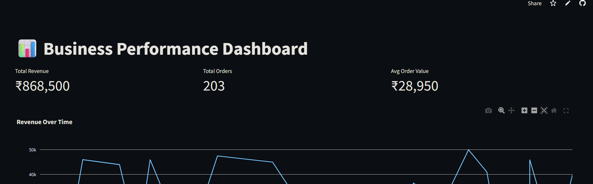

# 📊 Business Performance Dashboard

> A live business analytics dashboard that turns messy Google Sheets data into real-time visual insights — no Excel, no manual reports.



🔗 **[Live Demo](https://business-dashboard-123.streamlit.app/#business-performance-dashboard)** · 📁 **[View Code](https://github.com/Ashish10-AI/business-dashboard/blob/main/dashboard.py)**

---

## 🧩 The Problem

Most small businesses track their revenue in messy Excel files.
- No live view of performance
- No charts or visual trends
- Business owners waste hours compiling reports manually
- Decisions are delayed because data is always outdated

## ✅ The Solution

A business owner can now see their **full sales performance in 10 seconds**.

- Open the link → instantly see revenue, orders, trends
- Dashboard **updates automatically** every time the Google Sheet is edited
- No Excel skills needed. No manual reports. Just pure insight.

---

## 🔧 Tech Stack

| Tool | Purpose |
|------|---------|
| Python | Core logic & data processing |
| Streamlit | Web dashboard UI |
| Pandas | Data manipulation & analysis |
| Plotly Express | Interactive charts & graphs |
| Google Sheets API | Live data source connection |

---

## 📸 Features

- ✅ Live KPI cards (Total Revenue, Total Orders, Avg Order Value)
- ✅ Revenue Over Time line chart
- ✅ Auto-refresh on Google Sheet update
- ✅ Dark themed, clean UI

---

## ▶️ How to Run Locally

```bash
# 1. Clone the repo
git clone https://github.com/YOUR_USERNAME/business-dashboard.git
cd business-dashboard

# 2. Install dependencies
pip install -r requirements.txt

# 3. Add your Google Sheets credentials (see setup guide below)

# 4. Run the app
streamlit run app.py
```

### Google Sheets Setup
1. Go to [Google Cloud Console](https://console.cloud.google.com/)
2. Create a project → Enable Google Sheets API
3. Download `credentials.json` → place in project root
4. Share your Google Sheet with the service account email

---

## 📦 Requirements

```
streamlit
pandas
plotly
gspread
oauth2client
```

---

## 👨‍💻 Author

**Ashish** — Freelance Creative Technologist
[Portfolio](https://my-portfolio-neon-psi-88.vercel.app/) · [LinkedIn](https://www.linkedin.com/in/ashish-yadav-a294212b2/) · [GitHub](https://github.com/Ashish10-AI)
